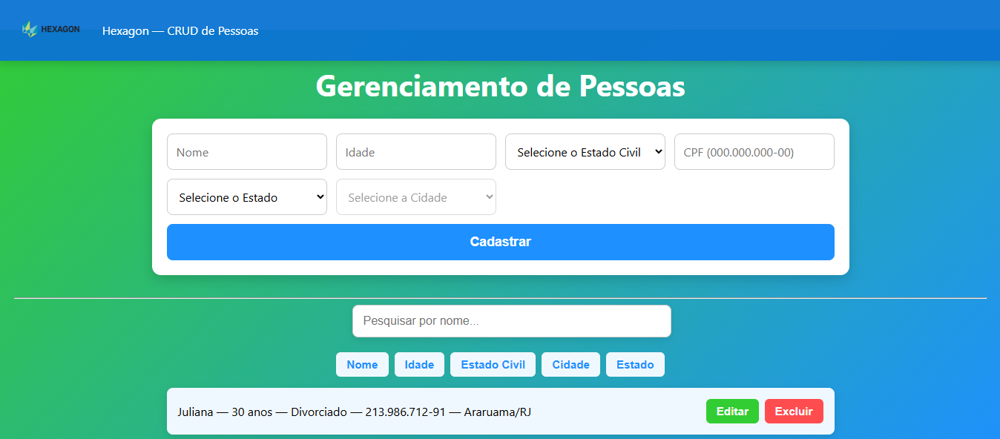

# Relatório do Projeto — CRUD de Pessoas (Hexagon Teste de Habilidade)

## 📌 Introdução
Este projeto foi desenvolvido como parte do **Teste de Habilidade — Hexagon**, com o objetivo de construir uma aplicação completa de CRUD (Create, Read, Update, Delete) para gerenciamento de pessoas, aplicando boas práticas de desenvolvimento front-end e integração com API.

A aplicação foi projetada para ser intuitiva, responsiva e com foco em boas práticas de **organização de código, usabilidade e escalabilidade**.

------------------------------------------------------------------------

## ⚙️ Tecnologias Utilizadas
- **Frontend**
  - React.js — biblioteca principal para construção da interface
  - JavaScript (ES6+) — lógica de componentes e funções utilitárias
  - CSS3 — estilização da aplicação
  - Fetch API — comunicação com backend
  - API do IBGE — preenchimento dinâmico de Estados e Cidades

- **Backend**
  - .NET 8 (C#) — construção da API REST
  - Entity Framework — persistência de dados
  - Swagger — documentação e teste de endpoints
  - CORS configurado para permitir acesso do frontend

- **Outros**
  - Git + GitHub — versionamento e compartilhamento
  - NPM — gerenciamento de pacotes no frontend

------------------------------------------------------------------------

## 📋 Funcionalidades Implementadas
1. **CRUD Completo**
   - Criar, listar, atualizar e excluir registros de pessoas.
2. **Validações**
   - Nome apenas letras
   - CPF formatado (000.000.000-00) com 11 dígitos
   - Idade positiva
   - Campos obrigatórios não podem ser vazios
3. **Integrações**
   - API IBGE para Estados e Cidades
4. **Paginação**
   - 5 registros por página
5. **Ordenação e Filtro**
   - Ordenação por qualquer campo
   - Campo de busca por nome
6. **Design**
   - Layout responsivo
   - Cabeçalho fixo
   - Botões coloridos (verde/editar, vermelho/excluir)

------------------------------------------------------------------------

## 🔑 Decisões de Desenvolvimento
- **React Hooks** (`useState`, `useEffect`) para controle de estado
- **Separação de responsabilidades**:  
  - `App.js` → formulários, listagem e lógica  
  - `PeopleService.js` → comunicação com API  
- **Paginação e ordenação no cliente**
- **CORS habilitado no backend** para integração com frontend
- **Proxy no `package.json` do frontend** para apontar para `http://localhost:5002`

------------------------------------------------------------------------


## � Executando no GitHub Codespaces

### 1️⃣ Criar Codespace

1. Acesse o GitHub e vá até o repositório: `barretowilliam/people-crud-app`.
2. Clique em **Code** > **Create codespace on main** (ou "New codespace").
3. Aguarde o ambiente ser provisionado.

### 2️⃣ Rodar o Backend (.NET API)

No terminal do Codespaces, execute:
```bash
cd backend/PeopleCrudApi
dotnet restore
dotnet run
```
O backend ficará disponível na porta **5002**.

### 3️⃣ Rodar o Frontend (React)

Abra um novo terminal e execute:
```bash
cd frontend
npm install
npm start
```
O frontend ficará disponível na porta **3000**.

### 4️⃣ Liberar as portas como públicas

No terminal, execute:
```bash
gh codespace ports visibility 3000:public 5002:public -c "$CODESPACE_NAME"
```
Assim, as portas 3000 (frontend) e 5002 (backend) ficarão acessíveis externamente.

### 5️⃣ Reabrir o link do frontend

Se necessário, reabra o link do frontend (porta 3000) pelo menu de portas do Codespaces ou copie o link gerado no terminal.

### 6️⃣ Configurar variável de ambiente do frontend

No diretório `frontend`, edite o arquivo `.env` (ou crie a partir do `.env.example`) e coloque:
```
REACT_APP_API_URL=https://<seu-codespace>-5002.app.github.dev/api/pessoas
```
Substitua `<seu-codespace>` pelo nome do seu Codespace (veja na URL do Codespaces ou rode `echo $CODESPACE_NAME`).

Depois, reinicie o frontend (`npm start`).


## 🖥️ Como Executar Localmente

1. Clone o repositório:
   ```bash
   git clone https://github.com/barretowilliam/people-crud-app.git
   cd people-crud-app
   ```
2. Siga os passos de backend e frontend acima, usando `localhost` nas URLs.

------------------------------------------------------------------------

## 🔒 Autenticação
Este projeto **não utiliza autenticação**.  
Caso fosse necessário, poderiam ser aplicados **JWT (JSON Web Token)** ou **OAuth2**, integrados com backend de usuários.

------------------------------------------------------------------------

## 📚 Conclusão
Este projeto reforça conceitos fundamentais de **desenvolvimento full stack**, tais como:
- Estruturação de um CRUD
- Integração de frontend e backend
- Uso de API externa (IBGE)
- Boas práticas de validação e usabilidade
- Organização de código para escalabilidade

------------------------------------------------------------------------

📌 **Observação final:**  
Este relatório foi incorporado ao `README.md` do repositório para facilitar a execução pelo recrutador.  

------------------------------------------------------------------------

## 📸 Demonstração


------------------------------------------------------------------------

## 👨‍💻 Autor
**William Barreto**  
🔗 [LinkedIn](https://www.linkedin.com/in/william-barreto-/)  
📧 barretoj.william@gmail.com  
